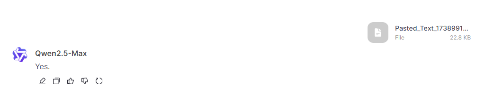

# Prompt:
## a golden retriever barking at the fence.

### State: Setup

#### Vocabulary Table:
| Japanese | Romaji | English | Portuguese-BR | Spanish | Klingon |
|:----------------:|:----------------:|:-----------------:|:---------------:|:----------------:|:---------------:|
| ゴールデンレトリバー | gooruden retoribā | golden retriever | labrador dourado | labrador dorado | QIb qagh      |
| 吠える | hoeru | to bark | latir | ladrar | QIch |
| フェンス | fensu | fence | cerca | cerca | vIt |

#### Sentence Structure:
[Subject] [Verb] [Location].

#### Clues, Considerations, Next Steps:
- This sentence describes an action happening at a specific location.
- The subject is the animal performing the action.
- Consider how to express "at the fence" in Japanese – think about location markers.
- Think about which verb form to use for an ongoing action.
- You can:
  - Try forming the first part about the dog barking.
  - Ask about how to express "at the fence."
  - Make an attempt at the full sentence.

---

### Story in Four Languages (Each with 3 Paragraphs)

#### English:
1. In a quiet suburban neighborhood, a golden retriever named Max stood near the white picket fence that surrounded his yard. He was known for his friendly demeanor, but today something had caught his attention. A strange shadow moved beyond the fence, and Max felt uneasy.
2. As the shadow lingered, Max began barking loudly, alerting everyone around him. His owner, Sarah, rushed outside to see what was wrong. She scanned the area but saw nothing unusual. Still, Max continued barking, staring intently at the fence.
3. Suddenly, a small kitten jumped out from behind the bushes near the fence. It mewed softly, looking up at Max with wide eyes. Max stopped barking immediately and wagged his tail, inviting the tiny intruder to play. The tension melted away as quickly as it had come.

#### Japanese:
1. 静かな郊外の住宅地で、ゴールデンレトリバーのマックスが白い柵の近くに立っていました。彼はいつも友好的な性格で知られていましたが、今日は何かが彼の注意を引いていました。影がフェンスの向こう側で動いており、マックスは不安を感じていました。
2. 影が留まると、マックスは大声で吠え始め、周囲の人々に警告しました。飼い主のサラは慌てて外に出て、何が問題なのか確認しようとしました。しかし、彼女は何も異常を見つけることができませんでした。それでも、マックスはフェンスを見つめながら吠え続けました。
3. 突然、小さな子猫がフェンスの近くの茂みから飛び出しました。子猫は大きな目でマックスを見上げながら、小さく鳴きました。マックスはすぐに吠えるのを止め、尻尾を振って小さな侵入者を遊びに誘いました。緊張は一瞬で解けました。

#### Portuguese-BR:
1. Em um tranquilo bairro suburbano, um labrador dourado chamado Max estava perto da cerca branca que cercava seu quintal. Ele era conhecido por seu comportamento amigável, mas hoje algo havia chamado sua atenção. Uma sombra estranha se movia além da cerca, e Max sentiu-se inquieto.
2. Enquanto a sombra permanecia, Max começou a latir alto, alertando todos ao redor. Sua dona, Sarah, correu para fora para ver o que estava errado. Ela examinou a área, mas não viu nada incomum. Ainda assim, Max continuou latindo, olhando fixamente para a cerca.
3. De repente, um pequeno gatinho saltou de trás dos arbustos perto da cerca. Ele miou suavemente, olhando para Max com olhos arregalados. Max parou de latir imediatamente e balançou o rabo, convidando o pequeno intruso para brincar. A tensão desapareceu tão rapidamente quanto havia surgido.

#### Spanish:
1. En un tranquilo vecindario suburbano, un labrador dorado llamado Max estaba cerca de la cerca blanca que rodeaba su patio. Era conocido por su carácter amigable, pero hoy algo había captado su atención. Una sombra extraña se movía más allá de la cerca, y Max se sintió incómodo.
2. Mientras la sombra permanecía, Max comenzó a ladrar fuerte, alertando a todos a su alrededor. Su dueña, Sarah, salió corriendo para ver qué pasaba. Escaneó el área pero no vio nada inusual. Aún así, Max continuó ladrando, mirando fijamente la cerca.
3. De repente, un pequeño gatito saltó desde detrás de los arbustos cerca de la cerca. Maulló suavemente, mirando a Max con ojos grandes. Max dejó de ladrar inmediatamente y movió la cola, invitando al pequeño intruso a jugar. La tensión se disipó tan rápido como había llegado.

#### Klingon:
1. boqHa'vo' wa'DIch, QIb qagh lo'laHbe'chugh vItlhutlhegh 'e' DaSop. QIchmoHvaD chenmoHlu'pu', 'ach jajvam wa'DIch 'e' vItlhutlhlaHbe'. vItDaq chelchu'wI' vItlhutlhlaHbe'chugh, QIb qagh vItlhutlhlaHbe'.
2. vItDaq chelchu'wI' vItlhutlhlaHbe'chugh, QIb qagh QIch law' Hoch wIlo'laHbe'. poHvaD wIlo'laHbe'chugh, vItlhutlhlaHbe'chugh. vItDaq chelchu'wI' vItlhutlhlaHbe'chugh, QIb qagh QIch law' Hoch wIlo'laHbe'.
3. vItlhutlhlaHbe'chugh, QIb qagh QIch law' Hoch wIlo'laHbe'. vItDaq chelchu'wI' vItlhutlhlaHbe'chugh, QIb qagh QIch law' Hoch wIlo'laHbe'. vItlhutlhlaHbe'chugh, QIb qagh QIch law' Hoch wIlo'laHbe'.

---

You can now attempt to translate the sentence or ask for clues!