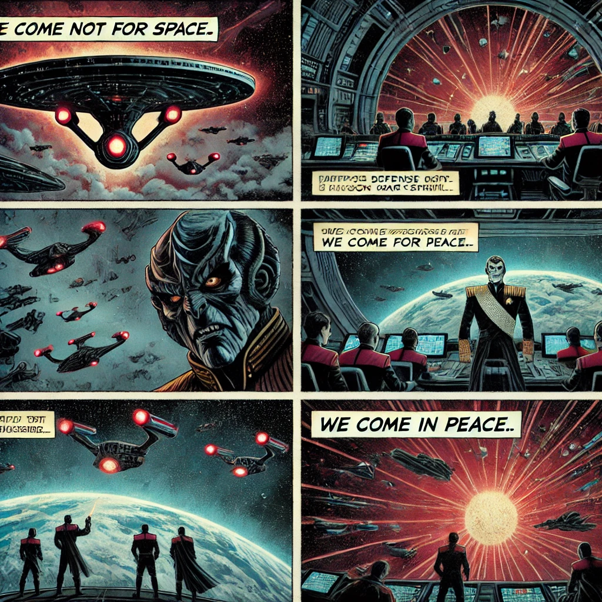
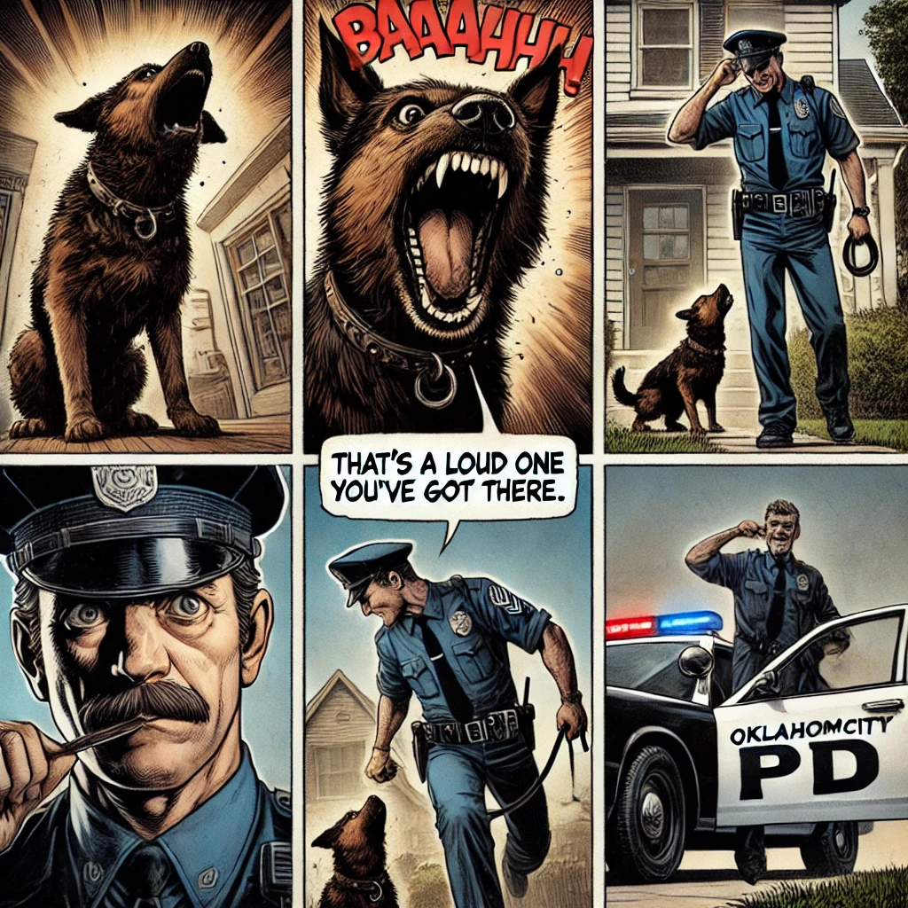

### Cheatsheet:  

| Japanese | Romaji | English | Portuguese-BR |  
|----------|--------|---------|--------------|  
| 鴉（からす） | karasu | raven | corvo |  
| 朝（あさ） | asa | morning | manhã |  
| 今朝（けさ） | kesa | this morning | esta manhã |  
| 見る（みる） | miru | to see | ver (verbo) |  
| いる | iru | to be (animate objects) | estar (verbo) |  
| 私（わたし） | watashi | I/me | eu/mim |  
| 窓（まど） | mado | window | janela |  
| ガラス | garasu | glass | vidro |  
| 後ろ（うしろ） | ushiro | behind | atrás |  

### Sentence Structure:  
[Time] [Subject] [Object] [Verb]? [Subject] [Verb] [Location].  

### Considerations:  
- The sentence begins with a time expression to indicate when the action happened.  
- The first part is a question asking if something was seen.  
- The second part describes where something was and what it was doing.  
- "Behind the window glass" needs to be structured carefully using position markers.  
- "Looking at" can be formed using the continuous tense of "to see" or an alternative verb for staring.  

### Possible Next Steps:  
- Try constructing the sentence based on the hints.  
- Ask for clues about the correct verb tense for "looking."  
- Ask how to express "behind the window glass" naturally.  
- Ask about particle usage.  

---

### **Story: A Haunting Gaze**  

#### **English:**  
This morning, as I sipped my coffee, a chilling sensation ran down my spine. I turned toward the window, and there they were—ravens, their dark eyes locked onto me through the glass. Their beady gaze was unwavering, unblinking.  

I stepped closer, heart pounding. The largest raven tilted its head slightly, as if studying me. Were they just birds, or something more? Their presence felt eerie, like an omen. The reflection of their black feathers merged with the dim light of the morning.  

Suddenly, a sharp tap on the glass shattered the silence. I jumped back, and in an instant, they were gone—vanished into the sky, leaving behind only a single black feather on my windowsill.  

---  

#### **Japanese:**  
今朝、コーヒーを飲んでいると、背筋がぞくりとした。私は窓の方を向いた。そこには、黒い瞳の鴉たちがいて、ガラス越しにじっとこちらを見つめていた。  

私は心臓を高鳴らせながら、一歩前へ出た。一番大きな鴉が首を傾げた。まるで私を観察しているようだった。ただの鳥なのか、それとも何か別の存在なのか。その姿は、不気味な予感を漂わせていた。黒い羽が朝の薄明かりに溶け込んでいた。  

突然、「コン！」という鋭い音がガラスを打ち、静寂を破った。私は驚いて後ずさった。しかし次の瞬間、彼らの姿は消えていた。ただ、窓辺に黒い羽が一枚だけ残されていた。  

---  

#### **Portuguese-BR:**  
Esta manhã, enquanto eu tomava meu café, um arrepio percorreu minha espinha. Virei-me para a janela e lá estavam eles—corvos, seus olhos escuros fixos em mim através do vidro. Seus olhares penetrantes eram inabaláveis, imóveis.  

Dei um passo à frente, com o coração acelerado. O maior dos corvos inclinou a cabeça ligeiramente, como se estivesse me estudando. Eram apenas pássaros ou algo mais? Sua presença parecia estranha, como um presságio. O reflexo de suas penas negras se fundia com a luz fraca da manhã.  

De repente, um som agudo ressoou contra o vidro, quebrando o silêncio. Dei um salto para trás, e num piscar de olhos, eles desapareceram—sumindo no céu, deixando para trás apenas uma única pena negra no parapeito da janela.  

---

Agora tente formar a frase! Se precisar de pistas, posso ajudar!

#2 The Second Interaction

### Cheatsheet:  

| Japanese | Romaji | English | Portuguese-BR |  
|----------|--------|---------|--------------|  
| 艦隊（かんたい） | kantai | fleet | frota |  
| 鳥（とり） | tori | bird | pássaro |  
| 猛禽類（もうきんるい） | moukinrui | bird of prey | ave de rapina |  
| 帝国（ていこく） | teikoku | empire | império |  
| 接近する（せっきんする） | sekkin suru | to approach | aproximar-se |  
| 地球（ちきゅう） | chikyu | Earth | Terra |  
| 防衛（ぼうえい） | bouei | defense | defesa |  
| 準備（じゅんび） | junbi | preparation | preparação |  
| 平和（へいわ） | heiwa | peace | paz |  
| 条約（じょうやく） | jouyaku | treaty | tratado |  
| 交渉する（こうしょうする） | koushou suru | to negotiate | negociar |  
| 知る（しる） | shiru | to know | saber (verbo) |  

### Sentence Structure:  
[Subject] [Verb] [Location], [Subject] [State]. [Reason] [Subject] [Verb].  

### Considerations:  
- The first part describes the movement of the fleet, including location details.  
- "Birds of prey" is translated in a way that conveys predatory birds.  
- The second part sets up Earth's lack of preparation.  
- The final part explains the unknown true intention of the fleet.  
- The verb "to negotiate" is useful to describe the peace treaty process.  

### Possible Next Steps:  
- Try constructing the sentence based on the hints.  
- Ask for clues about how to structure "just around Ceres' orbit."  
- Ask how to express "Earth's defenses were unprepared" naturally.  
- Ask about verb forms to express an ongoing approach.  

---

### **Story: The Unseen Peace**  

#### **English:**  
The alarms blared as the shadowy fleet of the Klingon Empire emerged from the vast darkness of space. Silhouettes of their warships loomed just beyond Ceres, their sharp, winged forms resembling predatory birds. Earth's defense forces scrambled, unprepared for such an aggressive display.  

Yet, aboard the Klingon flagship, there was no battle cry, no call to arms. Instead, the high chancellor stood solemnly before his council. "We come not for war," he declared. "We come to offer peace." His words, though honorable, carried the weight of generations of conflict. Would the Terrans believe them?  

As Earth's defense grid powered up, targeting the fleet, a single transmission was sent. "We come in peace." The words echoed across the void, a fragile hope amidst the cold expanse of space. Now, the fate of two civilizations rested on a single moment of trust.  

---  

#### **Japanese:**  
警報が鳴り響き、クリンゴン帝国の影のような艦隊が宇宙の暗闇から現れた。彼らの戦艦の影はセレスのすぐ外側に浮かび、鋭い翼を持つ猛禽のようだった。地球の防衛軍は不意を突かれ、混乱していた。  

しかし、クリンゴンの旗艦では、戦闘の号令もなく、武器を取る者もいなかった。その代わり、高等宰相が厳かに評議会の前に立っていた。「我々は戦争のために来たのではない」と彼は宣言した。「平和を提案するために来たのだ。」その言葉には、長年の対立の重みがあった。果たして地球人は信じるだろうか？  

地球の防衛網が活性化し、艦隊を狙う中、一つの通信が送信された。「我々は平和のために来た。」その言葉は虚空に響き渡った。冷たい宇宙の中に儚い希望が生まれた。この瞬間に、二つの文明の運命が委ねられた。  

---  

#### **Portuguese-BR:**  
Os alarmes soaram enquanto a sombria frota do Império Klingon emergia da vasta escuridão do espaço. As silhuetas de suas naves de guerra pairavam logo além de Ceres, suas formas afiadas e aladas lembrando aves de rapina. As forças de defesa da Terra foram pegas de surpresa, despreparadas para uma demonstração tão agressiva.  

Contudo, a bordo da nave-mãe klingon, não havia gritos de guerra, nem chamados às armas. Em vez disso, o alto chanceler estava solenemente diante de seu conselho. "Não viemos para a guerra", declarou. "Viemos oferecer paz." Suas palavras, embora honradas, carregavam o peso de gerações de conflito. Os terráqueos acreditariam nelas?  

Enquanto a rede de defesa da Terra se ativava, mirando a frota, uma única transmissão foi enviada. "Viemos em paz." As palavras ecoaram pelo vazio, uma esperança frágil no meio da imensidão fria do espaço. Agora, o destino de duas civilizações repousava sobre um único momento de confiança.  

---

Agora tente formar a frase! Se precisar de dicas, estou aqui para ajudar!

### **Cheatsheet:**  

| Japanese | Romaji | English | Portuguese-BR |  
|----------|--------|---------|--------------|  
| 犬（いぬ） | inu | dog | cachorro |  
| 吠える（ほえる） | hoeru | to bark | latir (verbo) |  
| 警察（けいさつ） | keisatsu | police | polícia |  
| 車（くるま） | kuruma | car | carro |  
| 怒る（おこる） | okoru | to be angry | ficar bravo (verbo) |  
| とても | totemo | very | muito |  
| 巡査部長（じゅんさぶちょう） | junsa buchou | sergeant | sargento |  
| 止まる（とまる） | tomaru | to stop | parar (verbo) |  
| 歩く（あるく） | aruku | to walk | andar (verbo) |  
| 方向（ほうこう） | houkou | direction | direção |  
| 私（わたし） | watashi | I/me | eu/mim |  

---

### **Sentence Structure:**  
[Subject] [Object] [Verb], [State]. [Subject] [Verb] [Direction].  

---

### **Considerations:**  
- The first part describes the dog’s action and its emotional state.  
- "Barking at" can be expressed with the correct verb conjugation and particle usage.  
- "Very angry" describes the dog’s state and should be structured naturally.  
- The second part describes an action in progress—how the sergeant is stopping and walking.  
- "Towards me" should be marked properly to indicate direction.  

---

### **Possible Next Steps:**  
- Try forming the sentence with the given clues.  
- Ask for hints about verb conjugation for "was barking."  
- Ask how to structure "towards me" naturally.  
- Ask about the best way to express "very angry" for a dog.  

---

## **Story: The Unexpected Encounter**  

### **English:**  
The sound of my dog’s furious barking shattered the quiet afternoon. His fur bristled as he stood rigid, growling at the police car parked in front of my house. I tugged on his leash, but his rage was uncontrollable. The police car door opened.  

A sergeant from the Oklahoma City Police Department stepped out, adjusting his hat as he closed the door behind him. His gaze met mine, and for a moment, I felt the weight of his presence. He started walking towards me, his boots making heavy steps on the pavement.  

I swallowed hard, gripping my dog's leash tighter. Had I done something wrong? My mind raced as he approached. But as he stopped in front of me, he smiled. “That’s a loud one you’ve got there,” he said, nodding toward my dog. The tension broke, replaced by nervous laughter.  

---

### **Japanese:**  
午後の静けさを破るように、私の犬が激しく吠えた。彼は毛を逆立て、家の前に停まった警察の車に向かって唸っていた。私はリードを引いたが、その怒りは収まらなかった。警察の車のドアが開いた。  

オクラホマシティ警察の巡査部長が車から降り、帽子を直しながらドアを閉めた。彼の視線が私に向けられ、その瞬間、私は彼の存在の重みを感じた。彼はゆっくりとこちらへ歩き始めた。彼のブーツが舗道を踏みしめる音が響く。  

私はごくりと唾をのみ、犬のリードを強く握った。何か悪いことをしただろうか？彼が近づくにつれ、考えが巡った。しかし、彼は目の前で立ち止まり、微笑んだ。「元気な犬だな」と彼は言い、私の犬に目を向けた。その瞬間、緊張が解け、私は思わず苦笑した。  

---

### **Portuguese-BR:**  
O latido furioso do meu cachorro rompeu o silêncio da tarde. Seu pelo se eriçou enquanto ele ficava tenso, rosnando para o carro da polícia estacionado em frente à minha casa. Puxei a coleira, mas sua raiva era incontrolável. A porta do carro da polícia se abriu.  

Um sargento do Departamento de Polícia de Oklahoma City saiu, ajustando o chapéu enquanto fechava a porta atrás de si. Seu olhar encontrou o meu, e por um momento, senti o peso de sua presença. Ele começou a caminhar em minha direção, suas botas ecoando no asfalto.  

Engoli em seco, apertando a coleira do meu cachorro com força. Eu tinha feito algo errado? Minha mente disparou enquanto ele se aproximava. Mas então, ele parou na minha frente e sorriu. “Esse aí tem pulmões fortes, hein?” disse ele, acenando para o meu cachorro. A tensão se desfez, dando lugar a um riso nervoso.  

---

Agora tente formar a frase! Se precisar de pistas, estou aqui para ajudar! 🚔🐕

